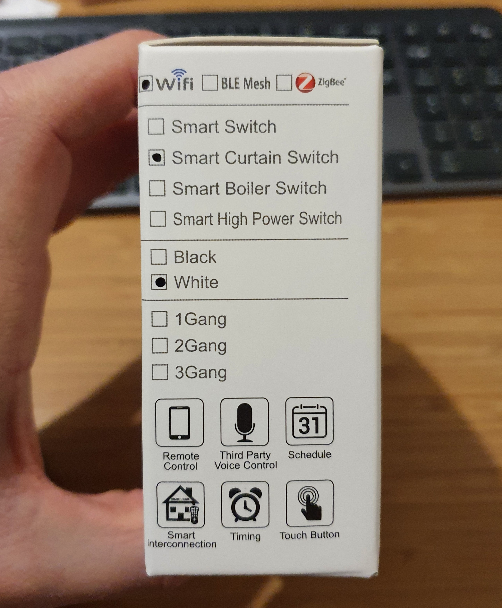

# Smart Shutter switch with ESPHome
Or *how to transform a Tuya noname proprietary (curtain) switch into an esphome (+Home Assistant) open source operated device*
_____________________________________


_____________________________________

For some time now I wanted to automatize my roller shutter so that I could close/open them remotely, all at once or automatically based on date or sun events.

A simple solution was to use Wi-Fi "smart switches", you can find some quite cheap ones on AliExpress...
One of my concerns, though, was the standby power consumption. Enabling the "high power saving" mode of esphome I managed to get from 0.6 to 0.4W. I would have preferred to get down to the 0.1W zone but I suppose that another radio tech would need to be used to get there...

Anyway, I went down the path and ordered a cheap "Wi-Fi Smart Curtain Switch" on [AliExpress](https://fr.aliexpress.com/item/1005002276767338.html?spm=a2g0o.9042311.0.0.7e1f6c37ZPyPmw)

This is what I received:




After quickly installing the Tuya App I was able to connect to the switches and they worked as expected. I guess I could have stopped there, but well if I did, I would not had written this article. My goal was to run open source software on these switches and control them with "my" cloud (well in fact not even a cloud since I am running Home Assistant on my local network...)


# Hardware

So I opened the switch, the design seemed relatively simple: there is a "high power PCB" that contains the relays and the 5V power supply.


The top PCB is the control part: it contains the touch button detection circuitry (an MCU?) and the Wi-Fi module.


**DANGER: The 5V/control board is not isolated from the main power, do not touch or connect anything while the switch is connected to main power (240V) !!**


**Note**: I ordered 4 switches in total, and interesting fact: out of the 4, 3 switches had different PCB versions! Fortunately it did not change the interface point with the Wi-Fi module so I had nothing specific to do about it (apart from gazing on how this was possible on the same/single order!). The only notable point is that on one version there is a blue LED lighting the Wi-Fi logo, on other versions that signal led is wired to the middle button orange LED (more details bellow)

Quickly looking at that control board, there was one bad and one good thing. The bad news was that the Wi-Fi module is based on a proprietary Tuya module that has a non easily modifiable firmware: [WB3S](https://developer.tuya.com/en/docs/iot/wb3s-module-datasheet?id=K9dx20n6hz5n4). However the good news was that this module has the exact same footprint and pinout as the ESP-12E/F and ESP-12S to some extent.
After some investigation I realized that the ESP-12S was slightly easier as a drop in replacement since it already had the necessary pins pulled up / down to automatically start on power up. Here is some [schematic](https://docs.ai-thinker.com/_media/esp8266/docs/esp-12s_product_specification_en.pdf) I found for that module (not sure if they are fully exact though...)

So I quickly ordered some ESP-12S modules on [AliExpress](https://fr.aliexpress.com/item/1005003136626008.html?spm=a2g0o.9042311.0.0.eb5e6c370QfhqQ)

After a thorough investigation I found out that all the control logic is done in the Wi-Fi module, and the other chip is really just used to operate the capacitive touch buttons.
Here are my findings:
* the two PCB board are linked with a 4 wires connectors: GND, 5V, relay1 and relay2 controls (outputs of the control board, input on the power board)
* the 3 buttons have 2 LEDs backlight: green and orange
* on one PCB version there is an additional blue LED on the top left corner (light up the Wi-Fi logo) and the orange LED seems to be hard linked to the touch button output directly. On the PCB that do not have that LED the middle button orange LED is used instead for Wi-Fi status
* the two relays are connected with the orange LED of the Up and Down buttons

Here is how the Wi-Fi module is connected to the board:


Okey all the investigation work was now done, let's start to actually hack the thing. The first thing to do was to change the WB3S module with the freshly received ESP-12S module. To do this you will need a hot gun. On the above picture you can see that I removed the immediately close plastic pad on the lower button (gently pull it out), and I added Kapton tape to protect the middle button plastic pad from the hot air.

After a few minutes you should get this:


You just have to clean out the remaining solder on the pad and the board is ready to receive the ESP-12S module.
**But before** you do that, it's easier to flash the ESP-12S with ESPHome **once** using the a USB to serial (TTL 3.3V) cable. At least a simple application that just connect to Wi-Fi, so the next firmware update can be done over the air.
Note that if you soldered already the module, not a big deal you can flash it in place since the only needed wires are RX/TX (they are not connected on the PCB) and pull down GPIO2 to ground (that's ok since it is an input on the PCB).
**However do not attempt this while the switch is connected to the main power.** Instead you can simply power the control board using the GND and 5V pins on the the 4 pins connector of the control board.

Anyway in my case I temporarily soldered the cables directly on the module so I could peacefully flash the ESP module. *Beware* the module power supply is 3.3V only (the control board has a 5V to 3.3V voltage regulator). I found a easy page describing how to wire an ESP-12F(E/S) module for USB/Serial flashing: [How to wire ESP12 for USB flashing](https://www.sensatio.io/tutorial-how-to-prepare-your-esp8266-esp-12-for-flashing)

It looked like this:


Then after plugin my [USB to serial TTL 3.3V dongle](https://fr.aliexpress.com/item/2005100405.html) and connecting the ESP-12 module, simply run the esphome command line to compile and flash the image.
See the software section for more details on ESPHome

Final step: remove the temporary wires, solder the ESP module on the control board, and you are ready to run!


# Software

## Integration
To generate the image to flash the ESP module I simply used [ESPHome](https://esphome.io/). It may look intimidating at first but it is actually *really* easy to use. Kudos to this project: it is truly amazing.

There is actually a simple [getting started guide](https://esphome.io/guides/getting_started_command_line.html) that you can follow to install esphome on your host PC and then compile your first firmware.
To flash the device, simply type the `esphome run yourproject.yaml` it will compile and then offer you options to flash your device. If it detects a USB to serial dongle it will propose you the Serial flashing, otherwise you always have the over-the-air flash method.
Once you will have flashed esphome on your device with the proper Wi-Fi credentials you will most certainly only use over-the-air update thereafter.

In order to manage this newly created smart switch I simply used [Home Assistant](https://www.home-assistant.io/). This is a bigger piece to chew, I won't go into the details on how to install and run it, but there is an extremely large amount of tutorials to set it up on the net.
The benefit to using Home Assistant is that it is pre-integrated with esphome and automatically detects devices, so once set up it becomes trivial to manage your esphome managed devices.

There is also a 'lighter' alternative to use the ESPHome dashboard (simpler tool to manage your ESPHome devices) but I did not try it.

To implement the shutter switch firmware I used this [yaml file](shutterswitch.yaml).
Modify the fields to add your own passwords and Wi-Fi credentials and then simply run `esphome run shutterswitch.yaml`

Once your device is flashed, booted, attached to the Wi-Fi network, Home Assistant should detect it. You can see/configure it in the Configure/Integration screen


**Note** if you have setup an API password in your esphome yaml file Home Assistant will prompt you for this password first.

Once enabled in Home Assistant, your dashboard should display the new 'cover' widget


## Automation

The next thing is to automate the opening and closing of the shutter. In my case I wanted to close the shutter every day 20 minutes before sun set, and open them on the morning on either the sun rise or after a fixed hour which ever come last, and only on a weekday.

For this I created two Home Assistant automation rules: In Home Assistant navigate to Configuration/Automation + Add Automation button.

Here are the two automation I added:

### Shutter close:

```yaml
alias: Shutter Close
description: ''
trigger:
  - platform: sun
    event: sunset
    offset: '-00:20'
condition: []
action:
  - service: cover.close_cover
    target:
      entity_id:
        - cover.volets_ch1
        - cover.volets_ch2
        - cover.volets_ch3
        - cover.volets_sdb
mode: single
```

### Shutter Open

```yaml
alias: Shutter Open
description: ''
trigger:
  - platform: time
    at: '07:30:00'
  - platform: sun
    event: sunrise
condition:
  - condition: sun
    after: sunrise
  - condition: time
    after: '07:30:00'
    weekday:
      - mon
      - tue
      - wed
      - thu
      - fri
action:
  - service: cover.open_cover
    target:
      entity_id:
        - cover.volets_ch1
        - cover.volets_ch2
        - cover.volets_ch3
        - cover.volets_sdb
mode: single
```

You are done, you won't have to run through the house to open and close your shutter anymore, yay!

Do not hesitate to send feedback! (Through GitHub issues, Pull Request, ideas, ...)